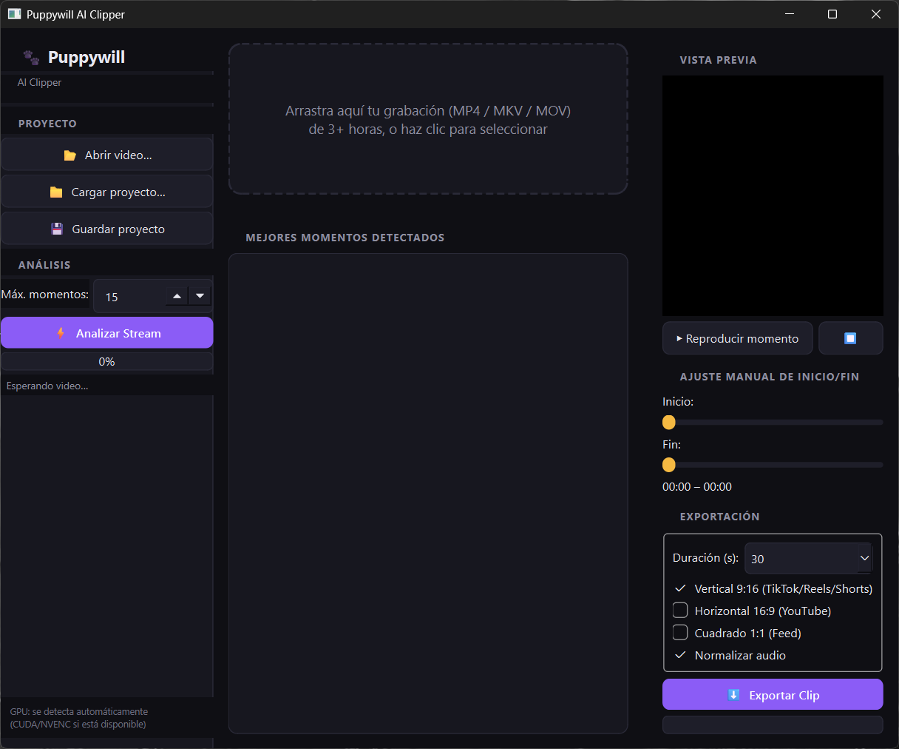
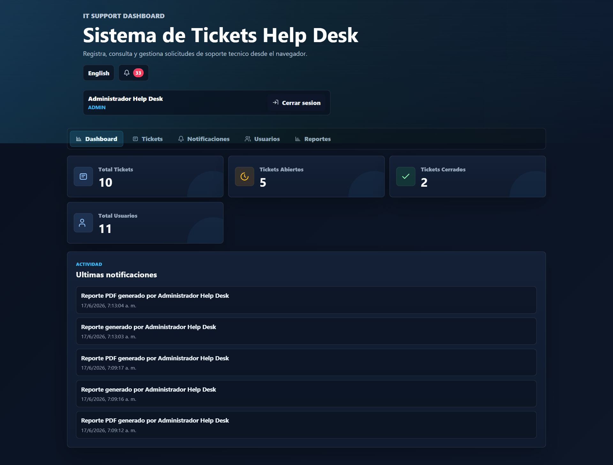
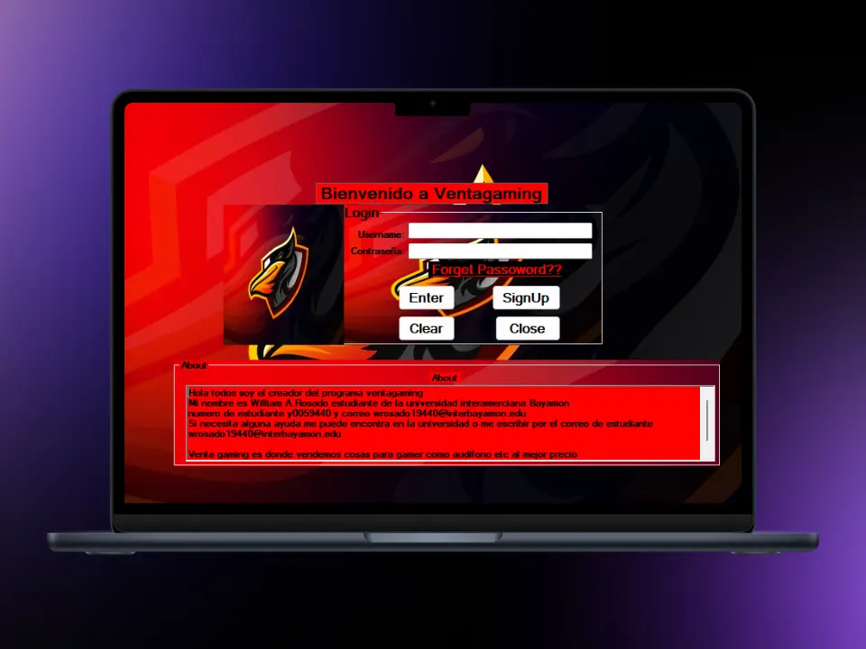
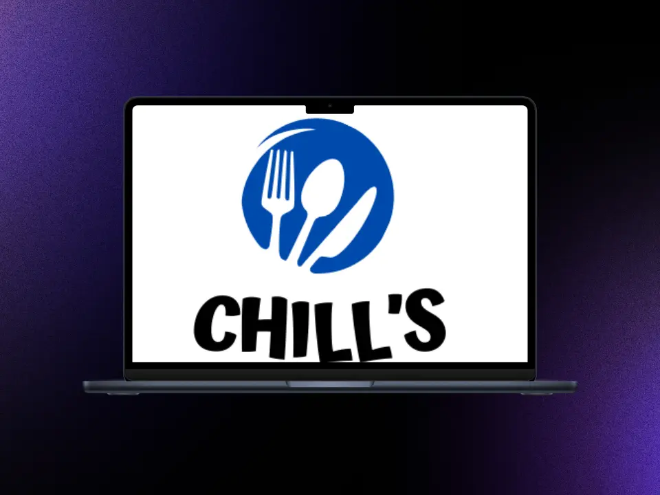

# Portafolio de William Rosado

Idioma: [Español](README_ES.md) | [English](README.md)

Portafolio personal desarrollado con Astro y Tailwind CSS para presentar mi perfil profesional, habilidades técnicas, experiencia en IT Support y proyectos destacados de software.

## Descripción

Este portafolio destaca proyectos relacionados con Help Desk, IT Support, soporte de bases de datos, desarrollo web y desarrollo de software. Está diseñado con estilo oscuro, layout responsive y una sección de proyectos clara para reclutadores y revisores técnicos.

## Tecnologías Utilizadas

- Astro
- Tailwind CSS
- JavaScript
- HTML
- CSS

## Proyectos Destacados

### Puppywill AI Clipper



Aplicación de escritorio para Windows que analiza grabaciones largas de streams de gaming e IRL para detectar y clasificar automáticamente los mejores momentos. Combina intensidad de audio, reacciones, movimiento visual y cambios de escena, y luego exporta clips limpios en formato vertical, horizontal o cuadrado.

Tecnologías utilizadas:

- Python
- PySide6 / Qt
- FFmpeg
- OpenCV
- NumPy
- NVIDIA NVENC

GitHub: [https://github.com/Puppywill/Puppywill-AI-Clipper](https://github.com/Puppywill/Puppywill-AI-Clipper)

### Help Desk Ticket System



Sistema profesional de tickets para IT Support con autenticación, acceso por roles, integración con SQL Server, administración de usuarios, notificaciones, flujo de recuperación de contraseña y reportes PDF/Excel usando datos reales de soporte.

Tecnologías utilizadas:

- HTML
- CSS
- JavaScript
- Node.js
- Express
- SQL Server

GitHub: [https://github.com/Puppywill/helpdesk-ticket-system](https://github.com/Puppywill/helpdesk-ticket-system)

### VentaGaming



Proyecto de base de datos de escritorio para administrar clientes y registros de ventas de una empresa de productos gaming, con exportación a Excel mediante Visual Basic, MySQL y XAMPP.

Tecnologías utilizadas:

- Visual Basic
- MySQL
- XAMPP

GitHub: [https://github.com/Puppywill/Ventagaming](https://github.com/Puppywill/Ventagaming)

### Chill's Restaurant



Sitio web colaborativo para un restaurante desarrollado con ASP.NET y Microsoft SQL Server, enfocado en ofrecer una experiencia web dinámica respaldada por contenido proveniente de una base de datos.

Tecnologías utilizadas:

- Bootstrap
- ASP.NET
- SQL Server

GitHub: [https://github.com/Puppywill/ChillsRestaurant](https://github.com/Puppywill/ChillsRestaurant)

## Estructura del Proyecto

```text
/
├── public/
│   ├── proyects/
│   └── screenshots/
├── src/
│   ├── components/
│   ├── layouts/
│   └── pages/
├── astro.config.mjs
├── tailwind.config.mjs
└── package.json
```

## Cómo Correr el Proyecto

Instalar dependencias:

```bash
npm install
```

Correr el proyecto localmente:

```bash
npm run dev
```

Crear el build de producción:

```bash
npm run build
```

Previsualizar el build:

```bash
npm run preview
```

## Autor

William Rosado

- B.S. Computer Science
- IT Support Specialist
- Database Support
- Puerto Rico

GitHub: [https://github.com/Puppywill](https://github.com/Puppywill)
